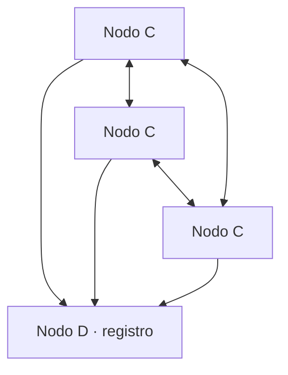

# Informe — TP1 Sistemas Distribuidos

> Esqueleto. Cada sección se completa a medida que avanzan los Hits, no al final.

## 1. Introducción

Objetivo del trabajo y alcance de lo entregado.

## 2. Arquitectura general

Diagrama del sistema completo: nodos C, nodo D y los canales entre ellos.

## 3. Desarrollo por Hit

Una subsección por ejercicio, con lo esencial. El detalle vive en el README de cada Hit.

## 4. Métricas y tiempos

### 4.1 JSON vs Protocol Buffers (Hit 8)

| Métrica | JSON sobre TCP | gRPC + Protobuf |
|---|---|---|
| Tamaño del saludo (bytes) | | |
| Tamaño del ack (bytes) | | |
| Latencia media ida y vuelta (ms) | | |
| Latencia p95 (ms) | | |

Método de medición: _completar._

### 4.2 Comportamiento de las ventanas (Hit 7)

Evidencia de dos ventanas consecutivas tomada de `data/inscripciones.json`.

## 5. Falacias del cómputo distribuido

Cuáles se hicieron visibles durante el desarrollo y cómo se manejaron: red no confiable, latencia no nula, ancho de banda finito.

## 6. Herramientas de IA utilizadas

El enunciado lo pide explícitamente. Qué herramienta usó cada integrante, en qué parte y para qué: codificar, depurar o documentar.

| Integrante | Herramienta | En qué ayudó |
|---|---|---|
| | | |

## 7. Conclusiones

## 8. Limitaciones y trabajo pendiente

Lo que quedó afuera, con el motivo. Una limitación reconocida puntúa mejor que una ausencia silenciosa.
