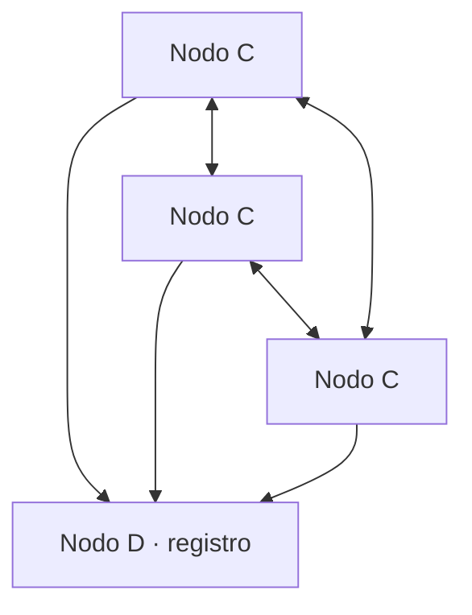

# Informe — TP1 Sistemas Distribuidos

> Esqueleto. Cada sección se completa a medida que avanzan los Hits, no al final.

## 1. Introducción

Objetivo del trabajo y alcance de lo entregado.

## 2. Arquitectura general

Diagrama del sistema completo: nodos C, nodo D y los canales entre ellos.

## 3. Desarrollo por Hit

Una subsección por ejercicio, con lo esencial. El detalle vive en el README de cada Hit.

### 3.1 Hit 4 — Nodo C bidireccional

Se unificaron cliente y servidor en un único nodo C. Cada instancia escucha
conexiones TCP y simultáneamente mantiene una conexión saliente hacia otro C.

El servidor crea un hilo por conexión aceptada. El cliente utiliza reconexión
con backoff exponencial entre 1 y 16 segundos. Los eventos se registran en
memoria y disco mediante `common.logger`.

### 3.2 Hit 5 — Serialización JSON

Los mensajes de texto se reemplazaron por objetos JSON delimitados por saltos
de línea. Este formato NDJSON resuelve el framing porque TCP no conserva los
límites entre mensajes.

`common.protocol.LectorDeLineas` reconstruye mensajes partidos o concatenados.
Cada saludo recibe un ACK cuyo campo `ref` coincide con el timestamp original.

### 3.3 Hit 8 — gRPC y Protocol Buffers

La comunicación se migró a gRPC. El contrato definido en `hit8/nodos.proto`
incluye los servicios `NodoCService` y `RegistroDService`.

Cada C escucha en un puerto aleatorio, se registra ante D, obtiene sus pares e
invoca el RPC `Saludar`. Se configuraron deadlines de cinco segundos, backoff
de reconexión y un pool de hilos para atender solicitudes concurrentes.

Los stubs de cliente y servidor se generan con `grpcio-tools` y no se editan
manualmente.

## 4. Métricas y tiempos

### 4.1 JSON vs Protocol Buffers (Hit 8)

| Métrica | JSON sobre TCP | gRPC + Protobuf |
|---|---:|---:|
| Tamaño del saludo | 117 bytes | 52 bytes |
| Tamaño del ACK | 122 bytes | 60 bytes |
| Tamaño total | 239 bytes | 112 bytes |
| Latencia media ida y vuelta | 0,035 ms | 0,097 ms |
| Latencia mediana | 0,035 ms | 0,097 ms |
| Latencia p95 | 0,040 ms | 0,110 ms |

Protocol Buffers redujo el payload total un 53,1 %. gRPC mostró mayor latencia
local debido al procesamiento de HTTP/2, despacho RPC y capas adicionales del
framework.

La medición utilizó `hit8/benchmark.py`, 20 intercambios de calentamiento y
500 iteraciones sobre loopback. Ambos protocolos conservaron una conexión
persistente. Los tamaños excluyen cabeceras TCP, HTTP/2 y framing gRPC.

### 4.2 Comportamiento de las ventanas (Hit 7)

Evidencia de dos ventanas consecutivas tomada de `data/inscripciones.json`.

## 5. Falacias del cómputo distribuido

Cuáles se hicieron visibles durante el desarrollo y cómo se manejaron: red no confiable, latencia no nula, ancho de banda finito.

## 6. Herramientas de IA utilizadas

El enunciado lo pide explícitamente. Qué herramienta usó cada integrante, en qué parte y para qué: codificar, depurar o documentar.

| Integrante | Herramienta | En qué ayudó |
|---|---|---|
| Justino Bernal | Codex | Explicación de sockets, concurrencia, NDJSON, gRPC y Protobuf; generación de código inicial, pruebas y documentación revisadas manualmente. |

## 7. Conclusiones

## 8. Limitaciones y trabajo pendiente

Lo que quedó afuera, con el motivo. Una limitación reconocida puntúa mejor que una ausencia silenciosa.
