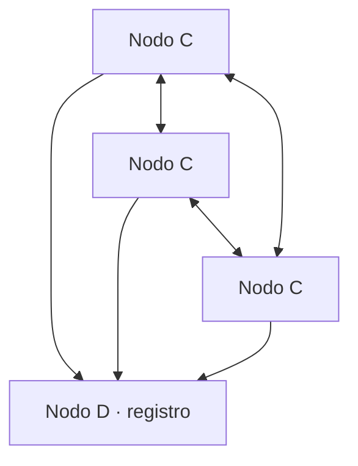

# Informe — TP1 Sistemas Distribuidos

Sistemas Distribuidos y Programación Paralela — 2026 · Dr. David Petrocelli
Universidad Nacional de Luján

| Integrante | Rol | Hits |
|---|---|---|
| Agustina Ortiz | Plataforma — repo, CI/CD, nube y entrega | 1, 2, 3 |
| Justino Bernal | Nodo C — transporte y RPC | 4, 5, 8 |
| _por completar_ | Nodo D — registro, coordinación y pruebas de integración | 6, 7 |

Repositorio: https://github.com/agustina-ortiz/TP1-SDyPP

## 1. Introducción

El trabajo recorre, de forma incremental, la construcción de un sistema
distribuido mínimo: empieza en un par cliente-servidor TCP de una sola
conversación y termina en un conjunto de nodos que se descubren entre sí y se
comunican por RPC. Cada Hit agrega exactamente una capacidad sobre el anterior,
de modo que el problema que resuelve queda aislado y es visible en el código.

La progresión tiene tres tramos. Los Hits 1 a 3 establecen el canal y lo hacen
resistente a que el otro extremo desaparezca. Los Hits 4 y 5 fusionan los dos
roles en un único nodo C bidireccional y reemplazan el texto plano por un
protocolo con framing explícito. Los Hits 6 a 8 introducen el nodo D como
registro central, la coordinación por ventanas de tiempo y la migración del
transporte a gRPC con Protocol Buffers.

El trabajo cubre los ocho Hits del enunciado.

## 2. Arquitectura general

El sistema tiene dos clases de nodo. Los nodos **C** son los pares que se
saludan entre sí: cada uno escucha conexiones entrantes y a la vez mantiene
conexiones salientes hacia otros C, de manera que ninguno es exclusivamente
cliente ni exclusivamente servidor. El nodo **D** no participa de esos saludos:
funciona como registro, mantiene en memoria qué nodos C están activos y le
devuelve a cada uno la lista de sus pares, además de coordinar las ventanas de
inscripción del Hit 7.

La consecuencia de diseño más importante es que un C no necesita conocer de
antemano la dirección de ningún otro C: solo conoce a D. Eso permite que los C
escuchen en un puerto asignado por el sistema operativo en lugar de uno fijo, y
que la topología cambie sin reconfigurar a nadie.

Las flechas hacia D representan el registro y la consulta de pares; las flechas
dobles entre nodos C, los saludos y sus confirmaciones.

El código común vive en `common/`: `logger.py` para el registro estructurado en
memoria y disco, `protocol.py` para la construcción y lectura de mensajes, y
`cli.py` para que todos los nodos compartan los mismos argumentos de línea de
comandos. Cada Hit tiene su carpeta propia y su `README.md`.

## 3. Desarrollo por Hit

Una subsección por ejercicio, con lo esencial. El detalle vive en el README de cada Hit.

### 3.1 Hit 1 — Cliente y servidor TCP

Dos procesos separados sobre sockets de la biblioteca estándar. El nodo B hace
`bind()`, `listen()` y queda bloqueado en `accept()`; el nodo A toma la
iniciativa, se conecta, saluda y recibe la respuesta. Es la materialización
mínima del principio cliente-servidor: quien espera es el servidor, quien inicia
es el cliente.

Se activó `SO_REUSEADDR` para evitar que el estado `TIME_WAIT` impidiera
relanzar el servidor durante las pruebas, y se usó `sendall()` en lugar de
`send()`, que puede enviar solo una parte del mensaje. El servidor atiende un
único saludo y termina: es deliberado, porque ese cierre es exactamente el
escenario que necesita el Hit 2 para probar la reconexión.

### 3.2 Hit 2 — Reconexión del cliente

El nodo A deja de depender de que B esté vivo. Si la conexión falla o se corta,
espera y reintenta con backoff exponencial de 1 a 16 segundos, implementado como
`min(espera * 2, ESPERA_MAXIMA)`. Reintentar a máxima velocidad quemaría CPU y
red sin ganar nada; el techo evita el extremo opuesto, que tras varias fallas el
cliente tarde minutos en notar que el servidor volvió. La espera se resetea al
conectar, para que una caída momentánea posterior no arranque esperando 16
segundos.

Se atajó `OSError` en lugar de cada error por separado, porque
`ConnectionRefusedError` y `ConnectionResetError` son ambos subclases suyas, y
se distinguió el corte limpio del abrupto: cuando el otro extremo cierra
ordenadamente `recv()` no lanza excepción, devuelve `b""`. Sin ese chequeo el
cliente entraría en un bucle leyendo vacío a toda velocidad. El saludo se volvió
periódico, cada 3 segundos, para que funcione como *keep-alive* y haga
observable el estado del canal.

### 3.3 Hit 3 — Servidor resiliente

El nodo B deja de morirse cuando el cliente desaparece: registra la caída,
cierra esa conexión y vuelve a esperar al próximo, indefinidamente. El punto que
decide si el Hit funciona es dónde se ubica el `try`: envuelve la conversación
con un cliente, no el bucle de `accept()`. Si envolviera el bucle exterior, un
cliente que muere rompería el bucle entero y el servidor caería igual que antes.

Se le puso `settimeout(1.0)` al socket que escucha. En Windows, `Ctrl+C` no
puede interrumpir una llamada de socket bloqueada: mientras `accept()` espera,
el proceso está dentro de Winsock y Python no llega a procesar la señal. Con el
timeout, `accept()` se rinde cada segundo y en ese respiro el intérprete atiende
la señal. `TimeoutError` se ataja antes y aparte de `OSError`, del que es
subclase: en el orden inverso se comería los timeouts y el servidor
interpretaría cada segundo que un cliente se cayó.

### 3.4 Hit 4 — Nodo C bidireccional

Se unificaron cliente y servidor en un único nodo C. Cada instancia escucha
conexiones TCP y simultáneamente mantiene una conexión saliente hacia otro C.

El servidor crea un hilo por conexión aceptada. El cliente utiliza reconexión
con backoff exponencial entre 1 y 16 segundos. Los eventos se registran en
memoria y disco mediante `common.logger`.

### 3.5 Hit 5 — Serialización JSON

Los mensajes de texto se reemplazaron por objetos JSON delimitados por saltos
de línea. Este formato NDJSON resuelve el framing porque TCP no conserva los
límites entre mensajes.

`common.protocol.LectorDeLineas` reconstruye mensajes partidos o concatenados.
Cada saludo recibe un ACK cuyo campo `ref` coincide con el timestamp original.

### 3.6 Hit 6 — Registro de contactos (nodo D)

Nodo D que mantiene en RAM los nodos C activos, expone `/health` y le devuelve a
cada C la lista de sus pares. A partir de acá los C escuchan en un puerto
asignado por el sistema operativo, porque ya no necesitan conocerse entre sí de
antemano.

_Por completar por el autor del Hit. El detalle vive en `hit6/README.md`._

### 3.7 Hit 7 — Sistema de inscripciones por ventanas

D coordina ventanas fijas de 60 segundos con un registro presente y uno futuro,
y persiste cada ventana en `data/inscripciones.json`.

_Por completar por el autor del Hit. El detalle vive en `hit7/README.md`._

### 3.8 Hit 8 — gRPC y Protocol Buffers

La comunicación se migró a gRPC. El contrato definido en `hit8/nodos.proto`
incluye los servicios `NodoCService` y `RegistroDService`.

Cada C escucha en un puerto aleatorio, se registra ante D, obtiene sus pares e
invoca el RPC `Saludar`. Se configuraron deadlines de cinco segundos, backoff
de reconexión y un pool de hilos para atender solicitudes concurrentes.

Los stubs de cliente y servidor se generan con `grpcio-tools` y no se editan
manualmente.

## 4. Métricas y tiempos

### 4.1 JSON vs Protocol Buffers (Hit 8)

| Métrica | JSON sobre TCP | gRPC + Protobuf |
|---|---:|---:|
| Tamaño del saludo | 117 bytes | 52 bytes |
| Tamaño del ACK | 122 bytes | 60 bytes |
| Tamaño total | 239 bytes | 112 bytes |
| Latencia media ida y vuelta | 0,035 ms | 0,097 ms |
| Latencia mediana | 0,035 ms | 0,097 ms |
| Latencia p95 | 0,040 ms | 0,110 ms |

Protocol Buffers redujo el payload total un 53,1 %. gRPC mostró mayor latencia
local debido al procesamiento de HTTP/2, despacho RPC y capas adicionales del
framework.

La medición utilizó `hit8/benchmark.py`, 20 intercambios de calentamiento y
500 iteraciones sobre loopback. Ambos protocolos conservaron una conexión
persistente. Los tamaños excluyen cabeceras TCP, HTTP/2 y framing gRPC.

### 4.2 Comportamiento de las ventanas (Hit 7)

Evidencia de dos ventanas consecutivas tomada de `data/inscripciones.json`.

_Por completar por el autor del Hit._

## 5. Falacias del cómputo distribuido

De las ocho falacias enunciadas por Deutsch y Gosling [DEU94], tres se hicieron
visibles en el código y obligaron a tomar decisiones concretas.

**"La red es confiable".** Es la que aparece primero y la más costosa de
ignorar. En el Hit 1 el cliente muere con `ConnectionRefusedError` si el
servidor no está, y el servidor muere si el cliente desaparece. Escribir el
backoff exponencial del Hit 2 y ubicar el `try` alrededor de la conversación en
el Hit 3 es, exactamente, dejar de suponer que la red y el otro extremo están
siempre ahí. Waldo y otros [WAL94] señalan que el error no es olvidarse de las
fallas sino tratarlas como excepcionales: en un sistema distribuido la falla
parcial es el caso normal, y por eso el manejo del error no puede quedar en un
`except` que aborta, sino en un camino de ejecución que continúa.

**"La latencia es cero".** La conexión no es una llamada a función. El
`settimeout(1.0)` del Hit 3 y los deadlines de cinco segundos del Hit 8 existen
porque un nodo nunca debe bloquearse indefinidamente esperando al otro lado: sin
ellos no hay forma de distinguir un par lento de uno muerto. Las métricas de la
sección 4 muestran además el costo que la falacia oculta: gRPC, que agrega
HTTP/2 y despacho de RPC, casi triplica la latencia de ida y vuelta frente a
JSON sobre TCP, y eso es sobre loopback, donde la red no aporta ningún retardo
propio.

**"El ancho de banda es infinito".** Es la falacia que motiva el Hit 8. El mismo
saludo pesa 117 bytes en JSON y 52 en Protocol Buffers, un 53,1 % menos en el
intercambio completo, porque JSON transmite los nombres de los campos en cada
mensaje y Protobuf los reemplaza por números de campo definidos en el `.proto`.
Con un saludo cada tres segundos la diferencia es irrelevante; con miles de
nodos, deja de serlo. La comparación deja explícito el intercambio de fondo:
Protobuf gana en tamaño y pierde en latencia local y en legibilidad, ya que el
mensaje deja de poder leerse con un `cat`.

## 6. Herramientas de IA utilizadas

| Integrante | Herramienta | En qué ayudó |
|---|---|---|
| Agustina Ortiz | Claude Code | Andamiaje inicial del repositorio y del CI, esqueletos de código con los huecos marcados para completar a mano, explicación de sockets y del flujo de trabajo con Git y Pull Requests, y revisión y redacción de la documentación. |
| Justino Bernal | Codex | Explicación de sockets, concurrencia, NDJSON, gRPC y Protobuf; generación de código inicial, pruebas y documentación revisadas manualmente. |
| _por completar_ | — | — |

## 7. Conclusiones

El recorrido incremental resultó ser el aporte principal del trabajo. Cada Hit
introduce un único problema y su solución queda localizada: la reconexión del
cliente en el Hit 2, la supervivencia del servidor en el Hit 3, el framing en el
Hit 5. Visto en conjunto, el salto entre el Hit 1 y el Hit 8 es grande, pero
ningún paso individual lo es, y eso hace que las decisiones de diseño se puedan
justificar una por una en lugar de quedar sepultadas en el resultado final.

La lección más concreta es que casi todo el código que separa un ejercicio de
sockets de un sistema distribuido no resuelve el caso feliz, sino la falla
parcial: el backoff, el reseteo de la espera, la distinción entre el `b""` y la
excepción, la ubicación del `try`, los deadlines. En el camino feliz, los Hits 1
y 8 hacen lo mismo: un nodo saluda a otro y recibe respuesta.

En cuanto a los formatos, la comparación del Hit 8 no arrojó un ganador
absoluto. Protobuf reduce el payload a la mitad, pero gRPC agrega latencia y
elimina la posibilidad de inspeccionar el tráfico a ojo. Para este sistema, con
saludos esporádicos entre pocos nodos, NDJSON sobre TCP habría alcanzado; la
migración se justifica por lo que habilita a escala, no por lo que mejora acá.

Sobre la organización del trabajo, dividir por nodo —C, D y plataforma— en lugar
de por Hit permitió avanzar en paralelo, y el flujo de rama más Pull Request
mantuvo `main` siempre en verde. La contracara es que esa división crea
dependencias duras entre integrantes: el despliegue no puede probarse hasta que
exista el nodo D, de modo que el atraso de una parte se propaga a otra que ya
estaba lista.

## 8. Limitaciones y trabajo pendiente

Lo que quedó afuera, con el motivo. Una limitación reconocida puntúa mejor que una ausencia silenciosa.

**El backoff no tiene *jitter*.** Con muchos clientes reintentando en
simultáneo, todos esperarían lo mismo y golpearían al servidor a la vez (efecto
*thundering herd*). La solución estándar es sumar un componente aleatorio a la
espera; no se implementó porque en los Hits 1 a 3 hay un solo cliente.

**Los Hits 1 a 3 no tienen delimitador de mensajes.** Suponen que un
`recv(1024)` trae el saludo entero, cosa que TCP no garantiza. Con saludos
cortos sobre loopback funciona siempre, pero es una suposición frágil; queda
resuelta desde el Hit 5 con NDJSON y `common.protocol.LectorDeLineas`. Se dejó
así a propósito, para que el Hit 5 tuviera un problema real que resolver.

**Las mediciones se tomaron sobre loopback.** Los números de la sección 4 no
incluyen retardo de red, pérdida de paquetes ni reordenamiento, así que la
ventaja de latencia de JSON sobre gRPC probablemente se diluya en una red real,
donde el tiempo de transmisión pasa a dominar sobre el costo de serializar.

## 9. Referencias

- [DEU94] Deutsch, L. P. y Gosling, J. *The Eight Fallacies of Distributed
  Computing*. Sun Microsystems, 1994.
- [WAL94] Waldo, J., Wyant, G., Wollrath, A. y Kendall, S. *A Note on
  Distributed Computing*. Sun Microsystems Laboratories, Technical Report
  SMLI TR-94-29, noviembre de 1994.
