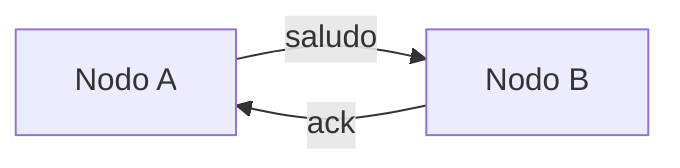

# Hit #N — <título>

> **Autor:** <nombre> · **Estado:** pendiente / en curso / terminado

## Qué resuelve

<Dos o tres líneas: qué pide el enunciado y qué hace este código.>

## Cómo ejecutarlo

```bash
# Desde la raíz del repositorio
python -m hitN.<archivo> --<flag> <valor>
```

<Si hacen falta dos terminales, mostrar las dos.>

## Arquitectura



<Reemplazar por el diagrama real. Mermaid se renderiza solo en GitHub.>

## Decisiones de diseño

- **<Decisión>:** <por qué esa y no la alternativa obvia.>
- **<Decisión>:** <...>

## Cómo se probó

<Qué pruebas automáticas lo cubren y qué se verificó a mano.>

## Limitaciones conocidas

<Lo que quedó afuera y por qué. Una limitación reconocida puntúa mejor que una ausencia silenciosa.>
