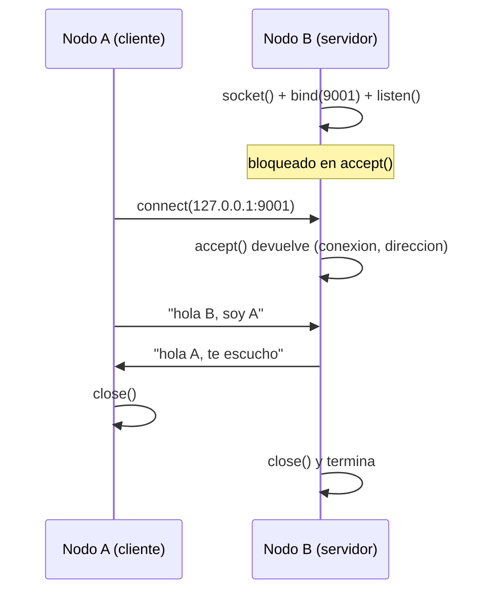

# Hit #1 — Cliente y servidor TCP

> **Autora:** Agustina Ortiz · **Estado:** terminado

## Qué resuelve

El punto de partida de todo el trabajo: dos procesos separados que se hablan por la red. El nodo **B** (`servidor.py`) se queda esperando pasivamente, y el nodo **A** (`cliente.py`) toma la iniciativa, se conecta y lo saluda. B responde y ambos terminan.

Es la materialización mínima del principio cliente-servidor: quien espera es el servidor, quien inicia es el cliente.

## Cómo ejecutarlo

Hacen falta **dos terminales**, porque son dos procesos distintos. Desde la raíz del repositorio:

```bash
# Terminal 1 — arrancar SIEMPRE primero
python hit1/servidor.py

# Terminal 2
python hit1/cliente.py
```

No requiere instalar nada: usa solo la biblioteca estándar de Python.

Salida esperada:

```
[B] Escuchando en 127.0.0.1:9001. Esperando el saludo de A...
[B] Se conecto A desde ('127.0.0.1', 54321)
[B] Recibido: hola B, soy A
[B] Respuesta enviada. Cierro y termino.
```

## Arquitectura



## Decisiones de diseño

- **`SO_REUSEADDR` en el servidor.** Al cerrar un socket, el sistema operativo deja el puerto en estado `TIME_WAIT` unos segundos. Sin esta opción, volver a levantar el servidor enseguida falla con *"Address already in use"*, lo que hace incómodo probar. Es una opción estándar en cualquier servidor de desarrollo.

- **`sendall()` en lugar de `send()`.** `send()` puede enviar solo una parte del mensaje y devolver cuántos bytes escribió; `sendall()` insiste hasta mandarlo entero. Para mensajes cortos rara vez cambia algo, pero usar `sendall()` evita una clase entera de bugs intermitentes.

- **El servidor atiende un saludo y termina.** Es deliberado: mantiene el Hit 1 en lo mínimo y deja que la resiliencia sea el aporte propio de los Hits 2 y 3. Además, este cierre es exactamente el escenario que el Hit 2 necesita para probar la reconexión.

- **`127.0.0.1` y no `0.0.0.0`.** Al escuchar en localhost, el servicio solo acepta conexiones de esta misma máquina. Para desarrollo es lo correcto; recién en los Hits desplegados hace falta abrirlo a la red.

- **Sin `common/logger.py`, solo `print()`.** Los Hits 1 a 3 son ejercicios de aprendizaje sobre sockets y conviene que no tengan más piezas que las necesarias. El registro estructurado en memoria y disco entra desde el Hit 4, cuando aparece el sistema real.

## Cómo se probó

Manualmente, con las dos terminales. Se verificó que:

- El servidor imprime la dirección del cliente y el puerto efímero que le asignó el sistema operativo (el cliente no elige su propio puerto: lo asigna el SO).
- El saludo llega completo y la respuesta vuelve.
- Levantar el cliente **sin** el servidor produce `ConnectionRefusedError`, que es el comportamiento correcto para este Hit y el problema que resuelve el Hit 2.

## Limitaciones conocidas

- **Atiende una sola conexión y termina.** Resuelto en el Hit 3.
- **El cliente muere si el servidor no está.** Resuelto en el Hit 2.
- **No hay delimitador de mensajes.** Se asume que un `recv(1024)` trae el saludo entero. TCP no garantiza eso: es un stream de bytes que no preserva los límites de los mensajes. Con saludos cortos en localhost funciona siempre, pero es una suposición frágil. Se resuelve en el Hit 5 con NDJSON y el `LectorDeLineas` de `common/protocol.py`.
