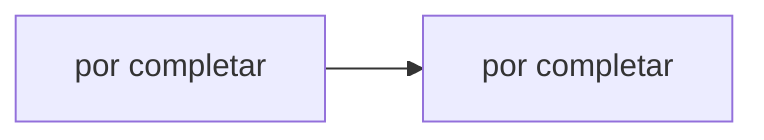

# Hit #1 — Cliente y servidor TCP

> **Autor:** Agustina · **Estado:** pendiente

## Qué resuelve

Servidor TCP (nodo B) que espera un saludo y lo responde, y cliente TCP (nodo A) que se conecta y saluda.

## Cómo ejecutarlo

```bash
# Desde la raíz del repositorio
python -m hit1.<archivo>
```

## Arquitectura



## Decisiones de diseño

- _Por completar por el autor del Hit._

## Cómo se probó

- _Por completar._

## Limitaciones conocidas

- _Por completar._
