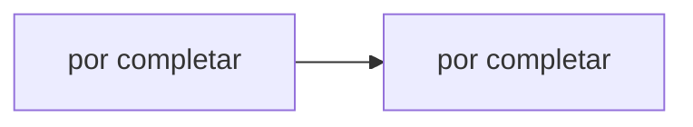

# Hit #2 — Reconexión del cliente

> **Autor:** Agustina · **Estado:** pendiente

## Qué resuelve

El nodo A detecta que B cerró la conexión y reintenta con backoff hasta volver a saludar.

## Cómo ejecutarlo

```bash
# Desde la raíz del repositorio
python -m hit2.<archivo>
```

## Arquitectura



## Decisiones de diseño

- _Por completar por el autor del Hit._

## Cómo se probó

- _Por completar._

## Limitaciones conocidas

- _Por completar._
