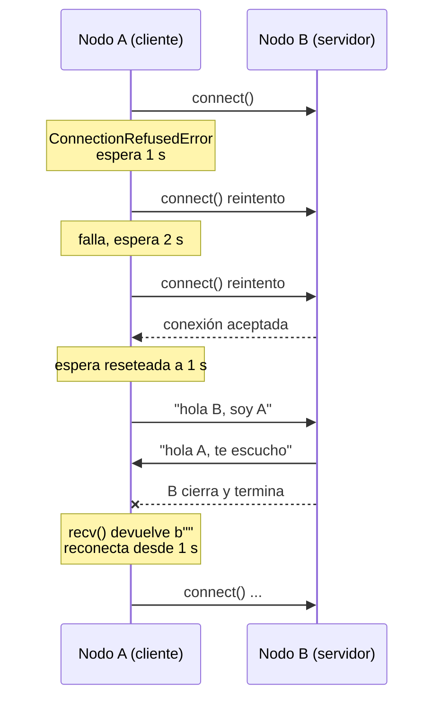
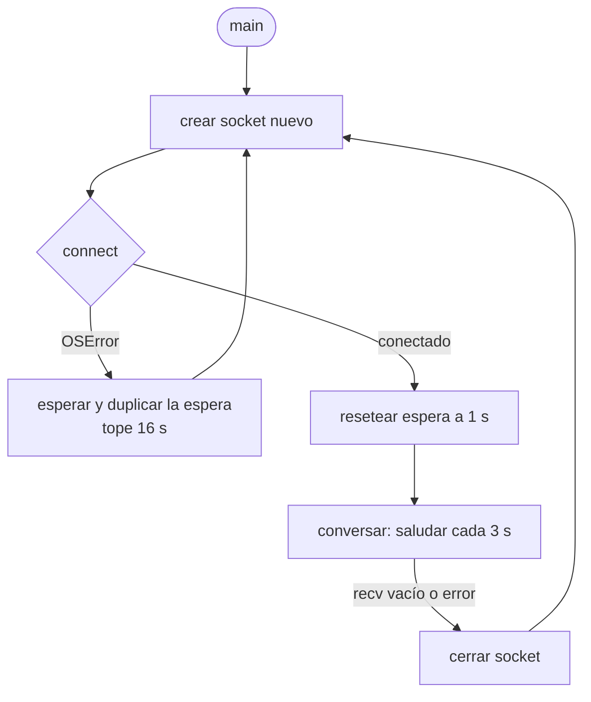

# Hit #2 — Reconexión del cliente

> **Autora:** Agustina Ortiz · **Estado:** terminado

## Qué resuelve

El nodo **A** deja de depender de que B esté vivo. Si B no está levantado, o se cae en medio de la conversación, A espera y vuelve a intentar hasta reconectar, y entonces saluda de nuevo.

El servidor no se modifica: el enunciado pide cambiar solo el código de A. La copia de `servidor.py` está acá únicamente para poder probarlo.

## Cómo ejecutarlo

```bash
# Terminal 1
python hit2/servidor.py

# Terminal 2
python hit2/cliente.py
```

El cliente ahora se puede arrancar **antes** que el servidor: se queda reintentando hasta que aparezca.

Salida esperada del cliente arrancado en soledad:

```
[A] Fallo la conexion: [WinError 10061] ... Esperando 1 segundos...
[A] Fallo la conexion: [WinError 10061] ... Esperando 2 segundos...
[A] Fallo la conexion: [WinError 10061] ... Esperando 4 segundos...
[A] Conectado a 127.0.0.1:9001
[A] Recibido: hola A, te escucho
[A] B cerro la conexion. Volviendo a reconectar...
```

## Arquitectura



Estructura interna del cliente, dos bucles con responsabilidades distintas:



## Decisiones de diseño

- **Backoff exponencial con techo: 1 s → 2 s → 4 s → 8 s → 16 s.** Reintentar a máxima velocidad quemaría CPU y red sin ganar nada, y con muchos clientes tumbaría al servidor justo cuando intenta levantarse. El techo de 16 s evita el otro extremo: que tras varias fallas el cliente tarde minutos en notar que el servidor volvió. Se implementa con `min(espera * 2, ESPERA_MAXIMA)`.

  Esto es la falacia **"la red es confiable"** de Waldo [WAL94] tratada explícitamente: escribir el backoff es asumir que la red no lo es.

- **La espera se resetea al conectar.** Sin ese reset, una reconexión exitosa dejaría el contador en 16 s y la siguiente caída haría esperar 16 segundos de entrada, aunque fuera una falla momentánea.

- **El socket se crea adentro del bucle, no afuera.** Un socket cerrado no se puede reutilizar: cada intento de conexión necesita uno nuevo. Crearlo una sola vez arriba del `while` hace que el primer reintento falle con `OSError` de forma difícil de diagnosticar.

- **Se ataja `OSError`, no cada error por separado.** `ConnectionRefusedError` (B no está) y `ConnectionResetError` (B murió de golpe) son ambos subclases de `OSError`. Atajar el padre cubre además otros fallos de red equivalentes para este caso, y evita que aparezca uno no contemplado y mate el proceso.

- **Se distingue el corte limpio del corte abrupto.** Si B cierra ordenadamente, `recv()` no lanza excepción: devuelve `b""`. Sin el chequeo `if not datos`, el cliente entraría en un bucle leyendo vacío a toda velocidad. Los dos caminos —el `b""` y la excepción— terminan en reconexión.

- **Saludo periódico cada 3 segundos en vez de uno solo.** Un saludo único dejaría la conexión muda y no habría forma de detectar la caída hasta el próximo intento de uso. El saludo periódico funciona como *keep-alive* y hace observable el estado del canal. Es el mismo mecanismo que van a necesitar los Hits 6 y 7 para saber qué nodos siguen activos.

- **`finally` para cerrar el socket.** Corre haya salido bien o mal. Sin él, cada intento fallido dejaría un descriptor de archivo abierto y el proceso terminaría agotando el límite del sistema operativo.

## Cómo se probó

Manualmente, en cuatro pasos:

1. Cliente **solo**, sin servidor → reintenta con esperas crecientes de 1, 2, 4, 8 y 16 s sin caerse nunca.
2. Se levanta el servidor con el cliente ya corriendo → el cliente se engancha solo y saluda.
3. El servidor responde y termina por su cuenta → el cliente detecta el `b""` y vuelve a reintentar desde 1 s.
4. Se levanta el servidor otra vez → reconecta y saluda normalmente.

También se probó matar el servidor con `Ctrl+C` inmediatamente después de la conexión, antes de que respondiera: ahí aparece `ConnectionResetError` en lugar del corte limpio, y el cliente también reconecta.

## Limitaciones conocidas

- **El backoff no tiene *jitter*.** Con muchos clientes reintentando en simultáneo, todos esperarían exactamente lo mismo y golpearían al servidor a la vez (efecto *thundering herd*). La solución estándar es sumar un componente aleatorio a la espera. No se implementó porque en este Hit hay un solo cliente.
- **Reintenta para siempre.** No hay un número máximo de intentos ni una forma de rendirse. Para este ejercicio es lo deseado.
- **Sigue sin delimitador de mensajes.** Misma limitación que el Hit 1, resuelta en el Hit 5.
