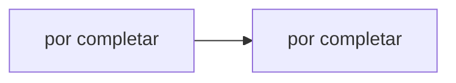

# Hit #3 — Servidor resiliente

> **Autor:** Agustina · **Estado:** pendiente

## Qué resuelve

El nodo B sigue en pie y aceptando nuevas conexiones aunque A muera abruptamente.

## Cómo ejecutarlo

```bash
# Desde la raíz del repositorio
python -m hit3.<archivo>
```

## Arquitectura



## Decisiones de diseño

- _Por completar por el autor del Hit._

## Cómo se probó

- _Por completar._

## Limitaciones conocidas

- _Por completar._
