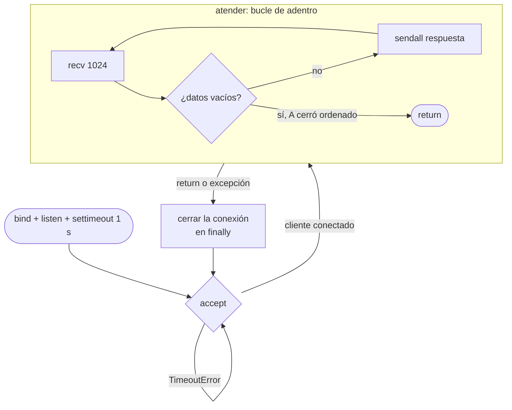
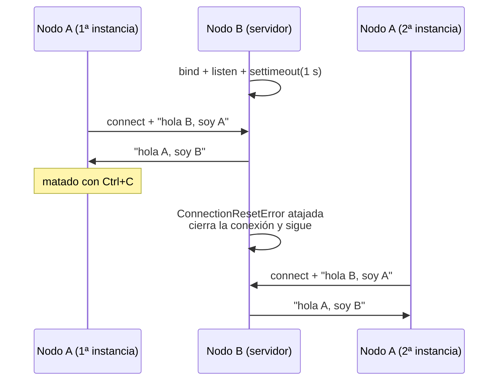

# Hit #3 — Servidor resiliente

> **Autora:** Agustina Ortiz · **Estado:** terminado

## Qué resuelve

El nodo **B** deja de morirse cuando el cliente desaparece. Si A cierra la conexión o lo matan de golpe, B lo registra, cierra esa conexión y vuelve a quedar a la espera del próximo cliente, indefinidamente.

El cliente no se modifica: el enunciado pide cambiar solo el código de B. La copia de `cliente.py` está acá para poder matarla repetidamente y comprobar que el servidor aguanta.

## Cómo ejecutarlo

```bash
# Terminal 1
python hit3/servidor.py

# Terminal 2
python hit3/cliente.py
```

Salida esperada del servidor mientras se mata y se relanza el cliente:

```
[B] Escuchando en 127.0.0.1:9001. Listo para atender clientes.
[B] Cliente conectado desde ('127.0.0.1', 54321)
[B] Recibido: hola B, soy A
[B] Ese cliente se cayo: [WinError 10054] ... Sigo esperando...
[B] Cliente conectado desde ('127.0.0.1', 54338)
[B] Recibido: hola B, soy A
```

Para cortar el servidor: `Ctrl+C` (tarda como mucho un segundo en responder, ver decisiones de diseño).

## Arquitectura

Lo central del Hit son dos bucles anidados con responsabilidades distintas: el de afuera gira una vez por **cliente**, el de adentro una vez por **mensaje**.





## Decisiones de diseño

- **El `try` envuelve la conversación, no el `accept()`.** Es el punto que decide si el Hit funciona. Si el `try` envolviera el bucle exterior, un cliente que muere rompería el bucle entero y el servidor caería igual que antes. Envolviendo solo `atender(conexion, direccion)`, un cliente que explota se pierde solo a sí mismo y el bucle sigue girando.

- **El `except` no lleva `break` ni `return`.** Va contra el instinto, pero toda la finalidad del Hit es que el bucle continúe después del error.

- **La conversación con un cliente está en su propia función.** Separar `atender()` de `main()` evita confundir los dos bucles y deja explícito que el error de un cliente se contiene dentro de una llamada.

- **`settimeout(1.0)` sobre el socket que escucha.** En Windows, `Ctrl+C` no puede interrumpir una llamada de socket bloqueada: mientras `accept()` espera sin clientes, el proceso está dentro de Winsock y Python no llega a procesar la señal, así que el servidor parece ignorar el `Ctrl+C`. Con el timeout, `accept()` se rinde cada segundo, lanza `TimeoutError`, el `continue` vuelve a esperar y en ese respiro Python atiende la señal. El costo es un despertar por segundo, despreciable.

  Es la falacia **"la latencia es cero"** en la práctica: un nodo de un sistema distribuido nunca debe bloquearse indefinidamente esperando al otro lado.

- **`TimeoutError` se ataja antes y aparte de `OSError`.** `TimeoutError` es subclase de `OSError`. Si se atajara `OSError` primero, se comería los timeouts y el servidor interpretaría cada segundo que un cliente se cayó. El orden de los `except` va siempre del más específico al más general.

- **`finally: conexion.close()`.** Garantiza que cada conexión se cierre haya terminado bien o mal. Sin esto, cada cliente atendido dejaría un descriptor de archivo abierto y a la larga el sistema operativo dejaría de conceder nuevos.

- **`SO_REUSEADDR` se mantiene del Hit 1.** Aquí importa aún más: durante la prueba el servidor se levanta y se baja muchas veces seguidas.

## Cómo se probó

Manualmente, con el ciclo de matar y relanzar:

1. Se arranca el servidor y luego el cliente → se saludan cada 3 segundos.
2. Se mata el **cliente** con `Ctrl+C` → el servidor informa la caída y vuelve a esperar, sin cerrarse.
3. Se vuelve a levantar el cliente → lo atiende normalmente.
4. Se repiten los pasos 2 y 3 cuatro veces seguidas → el servidor sigue en pie tras todas.
5. Se corta el servidor con `Ctrl+C` → cierra limpio, con el mensaje de salida y sin traza de error.

Se verificaron los dos caminos de desconexión: el corte ordenado (`recv()` devuelve `b""`) y el abrupto (`ConnectionResetError`).

## Limitaciones conocidas

- **Atiende un cliente por vez.** Si mientras conversa con A se conecta un segundo cliente, ese queda encolado en `listen()` hasta que A se vaya. No es un defecto respecto del enunciado, que pide sobrevivir y no atender en paralelo, pero es una limitación real. Se resuelve con hilos (`threading`), que hacen falta a partir del Hit 4, cuando un mismo nodo debe escuchar y hablar al mismo tiempo.
- **El servidor no detecta clientes colgados.** Si un cliente se queda conectado pero deja de enviar, `recv()` espera indefinidamente y bloquea la atención de los demás. Haría falta un timeout también sobre la conexión, o pasar a hilos.
- **Sigue sin delimitador de mensajes.** Misma limitación que los Hits 1 y 2, resuelta en el Hit 5.
