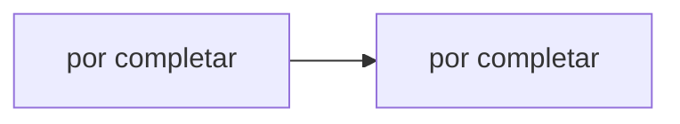

# Hit #4 — Programa C bidireccional

> **Autor:** por asignar · **Estado:** pendiente

## Qué resuelve

A y B se unifican en un único programa C que actúa como cliente y servidor a la vez, parametrizado por línea de comandos.

## Cómo ejecutarlo

```bash
# Desde la raíz del repositorio
python -m hit4.<archivo>
```

## Arquitectura



## Decisiones de diseño

- _Por completar por el autor del Hit._

## Cómo se probó

- _Por completar._

## Limitaciones conocidas

- _Por completar._
