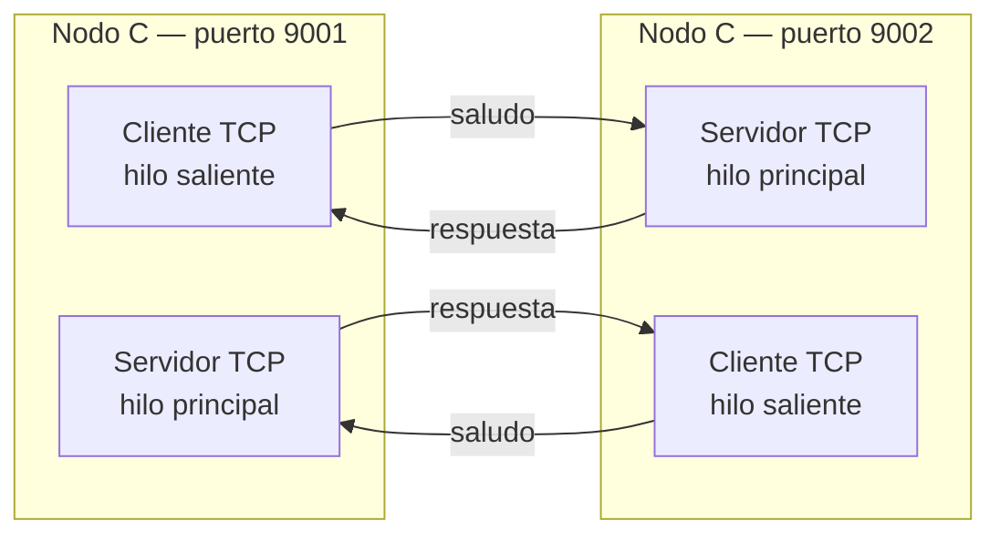

# Hit #4 — Programa C bidireccional

> **Autor:** Justino Bernal · **Estado:** terminado

## Qué resuelve

Los programas A y B de los Hits anteriores se unifican en un único programa C.
Cada instancia funciona simultáneamente como:

- Servidor TCP, escuchando saludos en una IP y puerto propios.
- Cliente TCP, conectándose al puerto de otro nodo C.

Con dos instancias configuradas entre sí, cada nodo inicia un canal saliente y
acepta un canal entrante. Ambos pueden enviar saludos y responder al otro al
mismo tiempo.

## Cómo ejecutarlo

Requisitos previos, desde la raíz del repositorio:

```bash
python3.11 -m venv .venv
source .venv/bin/activate
python -m pip install -r requirements.txt
```

Abrir dos terminales con el entorno virtual activo.

Terminal 1:

```bash
python -m hit4.nodo_c \
  --listen-host 127.0.0.1 \
  --listen-port 9001 \
  --peer-host 127.0.0.1 \
  --peer-port 9002 \
  --intervalo 2
```

Terminal 2:

```bash
python -m hit4.nodo_c \
  --listen-host 127.0.0.1 \
  --listen-port 9002 \
  --peer-host 127.0.0.1 \
  --peer-port 9001 \
  --intervalo 2
```

El primer nodo puede registrar errores `Connection refused` hasta que el
segundo esté disponible. Luego se conecta automáticamente.

Para detener cada proceso se utiliza `Ctrl+C`.

## Arquitectura



Cada servidor crea además un hilo para atender cada conexión aceptada. Esto
permite continuar aceptando conexiones mientras conversa con un cliente.

## Decisiones de diseño

- **Parámetros compartidos mediante `common.cli`.** Se reutiliza
  `parser_nodo_c()` para respetar los mismos nombres de argumentos acordados
  por el equipo.

- **Un hilo para el rol cliente.** El servidor queda en el hilo principal y el
  cliente se ejecuta en paralelo. Sin concurrencia, una llamada bloqueante como
  `accept()` impediría ejecutar el otro rol.

- **Un hilo por conexión aceptada.** El servidor no queda ocupado atendiendo un
  único cliente y puede volver inmediatamente a `accept()`.

- **Servidor en el hilo principal.** Esto permite que Python procese
  `KeyboardInterrupt` cuando se utiliza `Ctrl+C`.

- **Backoff exponencial con techo.** Ante fallos, el cliente espera
  `1, 2, 4, 8, 16` segundos. Evita reintentos continuos que consuman CPU y red.
  La espera vuelve a 1 segundo después de una conexión exitosa.

- **Socket nuevo por cada reconexión.** Un socket cerrado no puede reutilizarse.
  Por eso el cliente crea uno nuevo en cada vuelta del bucle externo.

- **`sendall()` para enviar.** A diferencia de `send()`, intenta entregar todos
  los bytes al sistema operativo o lanza una excepción.

- **Codificación UTF-8.** Los sockets transportan bytes. Se utiliza `encode()`
  antes de enviar y `decode()` después de recibir.

- **Cierre mediante `finally`.** Tanto conexiones aceptadas como sockets
  clientes y servidor se cierran aunque ocurra un error.

- **`SO_REUSEADDR`.** Permite reiniciar rápidamente el servidor sin esperar que
  el puerto salga del estado `TIME_WAIT`.

- **Timeout en `accept()`.** El servidor se despierta cada segundo para que
  `Ctrl+C` pueda ser atendido incluso cuando no llegan conexiones.

- **Logs compartidos mediante `common.logger`.** Cada nodo registra eventos en
  RAM, disco y `stderr`. El puerto forma parte del nombre del nodo para evitar
  mezclar logs de las dos instancias locales.

## Cómo se probó

### Prueba automatizada

```bash
python -m pytest tests/test_hit4.py -v
```

La prueba usa `socket.socketpair()` para crear dos sockets conectados sin
reservar puertos reales. Verifica:

- Recepción del saludo.
- Respuesta esperada.
- Cierre de la conexión.
- Registro ordenado de eventos en memoria.

También se ejecutó la suite completa:

```bash
python -m pytest -v
```

Resultado: `9 passed`.

### Prueba manual

1. Se inició C en el puerto 9001 sin levantar el segundo nodo.
2. Se verificó el backoff ante `Connection refused`.
3. Se inició C en el puerto 9002.
4. Se comprobaron conexiones en ambos sentidos.
5. Ambos nodos enviaron y recibieron mensajes cada dos segundos.
6. Se detuvo C-9001 con `Ctrl+C`.
7. C-9002 detectó la caída y comenzó a reconectarse.
8. C-9002 se detuvo limpiamente con `Ctrl+C`.

## Limitaciones conocidas

- **No existe framing de mensajes.** Cada `recv()` se interpreta como un
  mensaje completo, pero TCP es un stream y no conserva sus límites. Esta
  limitación se resuelve en el Hit 5 mediante JSON delimitado por saltos de
  línea y `common.protocol.LectorDeLineas`.

- **`recv()` no tiene timeout sobre conexiones activas.** Un cliente conectado
  que deje de enviar puede mantener un hilo bloqueado.

- **Los hilos son daemon.** Al finalizar el hilo principal, los secundarios
  terminan con el proceso sin una coordinación explícita mediante `join()`.

- **Un solo par saliente por nodo.** Es suficiente para el Hit 4. Los Hits 6 y
  7 incorporan descubrimiento de múltiples pares mediante el nodo D.

- **TCP sin autenticación ni cifrado.** Queda fuera del alcance específico de
  este Hit.