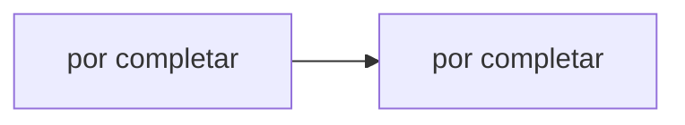

# Hit #5 — Serialización JSON

> **Autor:** por asignar · **Estado:** pendiente

## Qué resuelve

Los saludos y acks viajan como JSON delimitado por saltos de línea (NDJSON), según el contrato del grupo.

## Cómo ejecutarlo

```bash
# Desde la raíz del repositorio
python -m hit5.<archivo>
```

## Arquitectura



## Decisiones de diseño

- _Por completar por el autor del Hit._

## Cómo se probó

- _Por completar._

## Limitaciones conocidas

- _Por completar._
