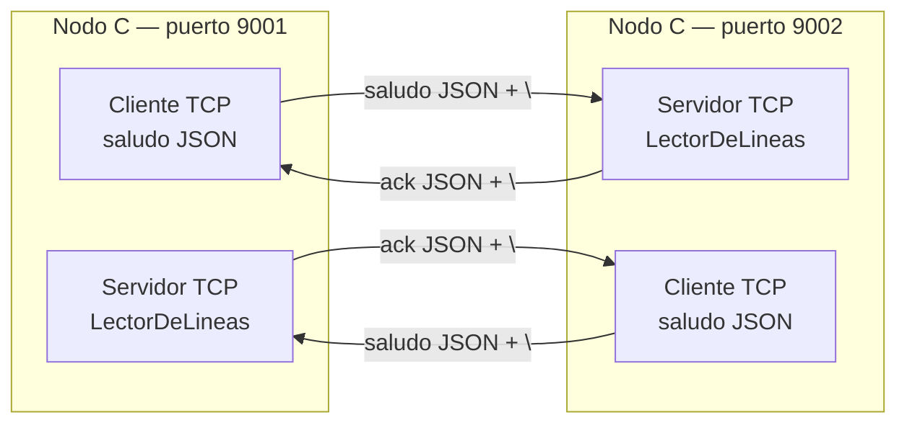

# Hit #5 — Serialización JSON

> **Autor:** Justino Bernal · **Estado:** terminado

## Qué resuelve

El nodo C bidireccional del Hit 4 deja de enviar texto sin estructura. Los
saludos y confirmaciones ahora son objetos JSON enviados sobre TCP.

Cada mensaje termina en `\n`, formato conocido como NDJSON. Esto permite
reconstruir mensajes aunque TCP entregue un mensaje partido o varios juntos.

Los mensajes siguen el contrato definido en `common/protocol.py`.

Saludo:

```json
{
  "tipo": "saludo",
  "from": {
    "host": "127.0.0.1",
    "port": 9001
  },
  "ts": "2026-09-03T20:42:58Z",
  "msg": "hola desde C"
}
```

Confirmación:

```json
{
  "tipo": "ack",
  "from": {
    "host": "127.0.0.1",
    "port": 9002
  },
  "ts": "2026-09-03T20:42:58Z",
  "ref": "2026-09-03T20:42:58Z"
}
```

`ref` relaciona cada ACK con el timestamp del saludo confirmado.

## Cómo ejecutarlo

Desde la raíz del repositorio, con el entorno virtual activo:

Terminal 1:

```bash
python -m hit5.nodo_c \
  --listen-host 127.0.0.1 \
  --listen-port 9001 \
  --peer-host 127.0.0.1 \
  --peer-port 9002 \
  --intervalo 2
```

Terminal 2:

```bash
python -m hit5.nodo_c \
  --listen-host 127.0.0.1 \
  --listen-port 9002 \
  --peer-host 127.0.0.1 \
  --peer-port 9001 \
  --intervalo 2
```

Para detener cada nodo se utiliza `Ctrl+C`.

## Arquitectura



## Decisiones de diseño

- **Reutilización de `common.protocol`.** Las funciones `saludo()`, `ack()` y
  `codificar()` mantienen un único formato compartido por todo el grupo.

- **NDJSON como framing.** TCP transporta un stream de bytes y no preserva los
  límites de los mensajes. Cada JSON termina en `\n` para identificar dónde
  finaliza.

- **Un `LectorDeLineas` por conexión.** El lector conserva bytes incompletos
  hasta recibir el delimitador. No se comparte entre conexiones porque cada
  canal tiene su propio stream.

- **Validación antes de procesar.** El servidor comprueba que el JSON sea un
  objeto, que su tipo sea `saludo` y que posea un timestamp.

- **ACK relacionado mediante `ref`.** El cliente no considera confirmado un
  saludo hasta recibir un ACK cuyo `ref` coincide con el timestamp enviado.

- **Un saludo pendiente por vez.** El cliente envía un saludo y espera su ACK
  antes de enviar el siguiente. Esto simplifica la correlación de respuestas.

- **UTF-8 centralizado.** `common.protocol` realiza la conversión entre
  diccionarios, JSON, texto y bytes.

- **Manejo de datos inválidos.** Se registran `JSONDecodeError` y
  `UnicodeDecodeError` sin derribar el proceso completo.

- **Concurrencia y reconexión heredadas del Hit 4.** Cada nodo mantiene roles
  cliente y servidor, usa hilos y conserva el backoff exponencial.

- **Logs con tamaño serializado.** Se registra cantidad de bytes de saludos y
  ACK para disponer de datos comparables con Protocol Buffers en el Hit 8.

## Cómo se probó

### Prueba automatizada

```bash
python -m pytest tests/test_hit5.py -v
```

La prueba envía dos mensajes JSON concatenados en una sola escritura TCP.
Verifica que:

- `LectorDeLineas` separe ambos saludos.
- El servidor produzca dos ACK.
- Los campos `ref` correspondan a los saludos originales.
- Los eventos se registren en orden.
- El hilo termine al cerrar la conexión.

Suite completa:

```bash
python -m pytest -v
```

Resultado: `10 passed`.

### Prueba manual

Se ejecutaron dos nodos en los puertos 9001 y 9002. Se comprobó:

- Reconexión mientras el segundo nodo estaba apagado.
- Canales TCP en ambos sentidos.
- Saludos JSON periódicos de 117 bytes.
- ACK JSON de 122 bytes.
- Coincidencia entre timestamp del saludo y `ref` del ACK.
- Detección del cierre del otro nodo.
- Backoff después de `Connection reset` y `Connection refused`.
- Cierre limpio con `Ctrl+C`.

## Limitaciones conocidas

- JSON es legible pero más verboso que un formato binario. Esta diferencia se
  medirá contra Protocol Buffers en el Hit 8.

- No existe límite máximo para un mensaje sin `\n`. Un emisor malicioso podría
  hacer crecer el buffer de `LectorDeLineas`.

- `recv()` no tiene timeout sobre una conexión activa. Un par conectado que no
  responda puede dejar un hilo bloqueado.

- El esquema JSON se valida manualmente y de manera parcial. Protocol Buffers
  aportará tipos y campos definidos formalmente.

- Cada C mantiene un único par saliente. El descubrimiento de múltiples pares
  corresponde a los Hits 6 y 7.

- TCP no utiliza autenticación ni cifrado en este ejercicio.