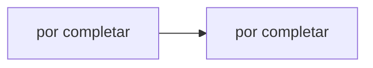

# Hit #6 — Registro de contactos (nodo D)

> **Autor:** por asignar · **Estado:** pendiente

## Qué resuelve

Nodo D que mantiene en RAM los nodos C activos, expone /health y le devuelve a cada C la lista de sus pares. C pasa a escuchar en un puerto aleatorio.

## Cómo ejecutarlo

```bash
# Desde la raíz del repositorio
python -m hit6.<archivo>
```

## Arquitectura



## Decisiones de diseño

- _Por completar por el autor del Hit._

## Cómo se probó

- _Por completar._

## Limitaciones conocidas

- _Por completar._
