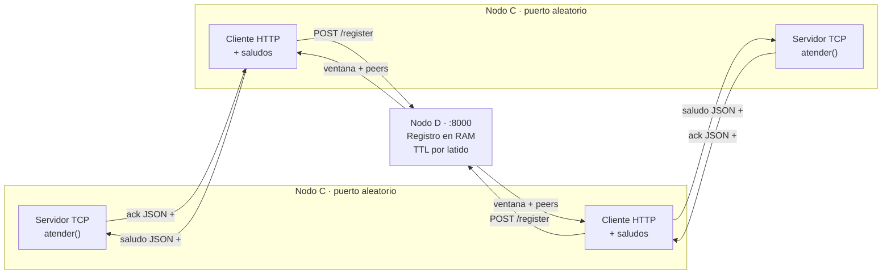

# Hit #6 — Registro de contactos (nodo D)

> **Autor:** Federico Kasparian · **Estado:** terminado

## Qué resuelve

Hasta el Hit 5, cada nodo C recibía por línea de comandos la dirección de su par
(`--peer-host`, `--peer-port`). Eso obliga a conocer la topología de antemano y
no sobrevive a que cambie.

Acá aparece el nodo **D**: un registro central que mantiene en RAM qué nodos C
están activos, expone `/health` y le devuelve a cada C la lista de sus pares.
Como ya nadie necesita saber la dirección de nadie por adelantado, los C pasan a
escuchar en **un puerto que les asigna el sistema operativo**.

La decisión que estructura todo el Hit: **el `POST /register` es a la vez alta y
latido**. No hay endpoint de keep-alive separado. Un nodo está activo mientras
siga registrándose; el que no vuelve dentro del TTL se considera caído.

## Contrato HTTP

Es el que fijó el grupo en el [README raíz](../README.md), sección 4.

**`POST /register`** — cuerpo `{"host": "10.0.0.5", "port": 54321}`

```json
{
  "ventana": "2026-09-05T01:27:00Z",
  "peers": [
    {"host": "127.0.0.1", "port": 22179},
    {"host": "127.0.0.1", "port": 22180}
  ]
}
```

**`GET /peers`** — la misma respuesta, sin cuerpo de entrada.

**`GET /health`** — los cinco campos que pide el enunciado:

```json
{
  "servicio": "registro-d",
  "estado": "ok",
  "nodos_activos": 3,
  "uptime_s": 9,
  "ventana_actual": "2026-09-05T01:27:00Z"
}
```

El campo `ventana` **todavía no tiene semántica en este Hit**: informa el minuto
en curso para que la forma del mensaje sea idéntica a la del Hit 7, que sí lo
usa. `hit8/nodo_c.py` ya lee ese campo, así que cambiarle la forma más adelante
costaría tocar código ajeno.

## Cómo ejecutarlo

Desde la raíz del repositorio, con el entorno virtual activo.

Terminal 1 — el registro:

```bash
python -m hit6.nodo_d --host 127.0.0.1 --port 8000 --ventana 30
```

Terminales 2, 3 y 4 — un nodo C en cada una. **No se indica puerto**: lo asigna
el sistema operativo.

```bash
python -m hit6.nodo_c --d-host 127.0.0.1 --d-port 8000 --intervalo 3
```

Terminal 5 — el observador:

```bash
curl http://127.0.0.1:8000/health
curl http://127.0.0.1:8000/peers

curl -X POST -H "Content-Type: application/json" \
  -d '{"host":"10.0.0.5","port":9001}' \
  http://127.0.0.1:8000/register
```

> **En PowerShell**, `curl` es un alias de `Invoke-WebRequest` y manipula las
> comillas antes de pasárselas al ejecutable. Los `GET` funcionan con
> `curl.exe`, pero para el `POST` conviene el cmdlet nativo:
>
> ```powershell
> Invoke-RestMethod -Uri http://127.0.0.1:8000/register -Method Post `
>   -ContentType 'application/json' -Body '{"host":"10.0.0.5","port":9001}'
> ```

`--ventana` se usa acá como TTL. Es el mismo número que en el Hit 7 pasa a ser
la duración de la ventana.

Para detener cada proceso se utiliza `Ctrl+C`.

## Arquitectura



Las flechas hacia D son HTTP; las flechas entre nodos C son NDJSON sobre TCP,
exactamente el mismo protocolo del Hit 5. **Lo que cambia en este Hit es cómo se
descubren, no cómo se hablan.**

## Decisiones de diseño

- **`http.server` de la biblioteca estándar, no FastAPI.** El contrato del grupo
  dice sockets de la stdlib, `grpcio` solo para el Hit 8 y `pytest` para las
  pruebas. Agregar FastAPI y uvicorn obligaba a tocar `requirements.txt`, el
  `Dockerfile` y avisarle al grupo, para tres endpoints sin validación compleja.
  El costo es escribir a mano el ruteo, los códigos de estado y la lectura del
  cuerpo.

- **`urllib.request` en el cliente, no `requests`.** Mismo argumento: cero
  dependencias nuevas.

- **El registro es el latido.** Un solo endpoint hace alta y refresco. Un nodo
  que deja de responder desaparece solo, sin que nadie tenga que darlo de baja.

- **Diccionario con clave `(host, port)`.** El alta es idempotente por
  construcción: un C que se registra cada tres segundos durante horas no genera
  duplicados ni obliga a recorrer una lista buscando repetidos.

- **Purga perezosa dentro de `activos()`, no un hilo barrendero.** Si nadie
  pregunta, no importa que el diccionario tenga entradas vencidas. Un hilo
  aparte agregaría concurrencia sin ganar nada.

- **Se purga dentro del lock y se loguea afuera.** Escribir en el log toca
  disco; hacerlo con el lock del registro tomado frenaría a todos los demás
  hilos durante esa escritura.

- **`cantidad()` no toma el lock.** Delega en `activos()`, que sí lo toma.
  `threading.Lock` **no es reentrante**: si los dos lo tomaran, el proceso se
  colgaría.

- **El reloj se inyecta por parámetro.** Sin eso, probar la expiración por TTL
  exigiría dormir, y `pytest.ini` corta cualquier prueba a los 30 segundos.

- **`--ventana` se reutiliza como TTL.** No hace falta tocar `common/cli.py`, y
  deja explícito que es el mismo número que en el Hit 7 pasa a significar otra
  cosa.

- **D devuelve la lista completa; el que se filtra es C.** `GET /peers` no sabe
  quién pregunta, así que no podría excluirlo. Si `/register` se comportara
  distinto, "peers" tendría dos significados en dos endpoints. `es_el_mismo_nodo()`
  resuelve el filtro del lado de C, igual que hace `hit8/nodo_c.py`.

- **Una conexión TCP efímera por par y por ciclo.** En el Hit 5 había una
  conexión persistente porque había un solo par fijo. Acá la lista cambia en
  cada vuelta: se pagan más handshakes a cambio de no gestionar un pool de
  conexiones vivas contra nodos que pueden haber desaparecido.

- **El `try` del saludo envuelve un solo par, no el bucle.** Si envolviera el
  bucle, un único par caído saltearía a todos los que vienen después. Es el
  mismo razonamiento del Hit 3 sobre dónde ubicar el `try`.

- **Timeout de 5 s en todas las llamadas salientes.** Sin él, un D colgado
  bloquearía el hilo del nodo C para siempre. Es la falacia "la latencia es
  cero" aplicada al registro.

- **`crear_servidor()` está separado del bucle de `accept`.** Hay que conocer el
  puerto **antes** de empezar a atender, porque es el dato que C tiene que
  registrar en D. `bind((host, 0))` lo pide y `getsockname()[1]` lo lee.

- **Las dependencias del handler se inyectan con `functools.partial`.** La
  stdlib instancia `BaseHTTPRequestHandler` una vez por request y resuelve el
  pedido completo dentro de `__init__`, así que los atributos se asignan
  **antes** de llamar al `__init__` del padre.

- **`log_message()` se sobreescribe para que no imprima nada.** La stdlib escupe
  líneas estilo Apache a stderr; mezcladas con el JSON de `common.logger` harían
  ilegible la evidencia.

- **`bool` se rechaza explícitamente como puerto.** En Python `bool` es subclase
  de `int`, así que `{"port": true}` pasaría como puerto 1 sin ese chequeo.

## Cómo se probó

### Pruebas automatizadas

```bash
python -m pytest tests/test_hit6.py -v
```

Resultado: **14 passed**. Cubren:

- Que registrar dos veces el mismo `(host, port)` deje un solo activo.
- Que un nodo que deja de registrarse expire por TTL, con reloj inyectado y sin
  dormir, y que quede el evento `nodo_expirado`.
- Que `activos()` devuelva la forma exacta del contrato y en orden estable.
- Que `/register` y `/peers` respondan `{ventana, peers}` y que coincidan.
- Que `/health` tenga **exactamente** los cinco campos del contrato.
- Que cinco formas distintas de cuerpo inválido devuelvan 400 sin registrar nada
  (`host` vacío, `port` ausente, `port` como texto, `port` fuera de rango, y un
  cuerpo que no es objeto).
- Que una ruta desconocida dé 404 y un método equivocado dé 405.
- Que el nodo C se registre contra un D real levantado en proceso y reciba los
  pares.

Suite completa del repositorio:

```bash
python -m pytest -v
```

Resultado: **42 passed**.

### Prueba manual

Cuatro procesos en una máquina Windows: un D con `--ventana 30` y tres nodos C
con `--intervalo 3`.

**1. Puertos asignados por el sistema operativo.** Los tres C levantaron en
`22179`, `22180` y `22181`, y aparecieron en `/peers` sin que nadie los
configurara.

```json
{"evento": "nodo_iniciado", "host": "127.0.0.1", "port": 22179, "registro": "127.0.0.1:8001"}
{"evento": "registro_confirmado", "ventana": "2026-09-05T01:27:00Z", "cantidad_peers": 3}
{"evento": "ack_recibido", "origen": "127.0.0.1:22180", "latencia_ms": 2.946}
{"evento": "ack_recibido", "origen": "127.0.0.1:22181", "latencia_ms": 2.302}
```

Cada C saluda a los otros dos y se saltea a sí mismo: con tres pares en la lista
se registran dos `ack_recibido`, nunca tres.

**2. Expiración por TTL.** Se mató el C del puerto `22181`. Durante los 30
segundos siguientes los otros dos lo siguieron recibiendo en la lista de pares y
fallaron al saludarlo, hasta que D lo dio de baja:

```json
{"nivel": "WARN", "evento": "fallo_saludo", "destino": "127.0.0.1:22181", "error": "[WinError 10061] ... el equipo de destino denegó expresamente dicha conexión"}
{"nodo": "nodo-d", "evento": "nodo_expirado", "host": "127.0.0.1", "port": 22181}
```

`/health` pasó de `"nodos_activos": 3` a `"nodos_activos": 2`, y `/peers` dejó
de listarlo. **Esa ventana de hasta 30 segundos en la que un nodo muerto sigue
figurando es la inconsistencia que el Hit 7 ataca con otro modelo.**

**3 y 4. Caída y regreso de D.** Se mató el nodo D. Los dos C sobrevivieron y
reintentaron con backoff exponencial:

```json
{"nivel": "WARN", "evento": "fallo_registro", "destino": "127.0.0.1:8001", "reintento_s": 1.0}
{"nivel": "WARN", "evento": "fallo_registro", "destino": "127.0.0.1:8001", "reintento_s": 2.0}
{"nivel": "WARN", "evento": "fallo_registro", "destino": "127.0.0.1:8001", "reintento_s": 4.0}
{"nivel": "WARN", "evento": "fallo_registro", "destino": "127.0.0.1:8001", "reintento_s": 8.0}
{"evento": "registro_confirmado", "ventana": "2026-09-05T01:28:00Z", "cantidad_peers": 2}
```

Al volver a levantar D, los dos C se re-registraron solos y la espera volvió a
1 segundo, sin intervención. Es el argumento del Hit 2 aplicado al registro: la
falacia "la red es confiable" resuelta con un camino de ejecución que continúa,
no con un `except` que aborta.

## Limitaciones conocidas

- **Un nodo muerto sigue listado hasta que vence el TTL.** Durante ese lapso los
  demás C intentan saludarlo y fallan. Bajar el TTL reduce la ventana pero
  aumenta el tráfico de latidos. El Hit 7 cambia el modelo entero para atacar
  esto.

- **D es un punto único de falla y no está replicado.** Si D cae, ningún nodo
  nuevo se descubre. Los C que ya estaban corriendo siguen saludándose con la
  última lista que recibieron, así que la degradación es elegante, pero el
  sistema deja de incorporar y de dar de baja.

- **Sin autenticación ni TLS.** Cualquiera que alcance el puerto puede registrar
  nodos falsos o leer la topología completa. El ejercicio se concentra en
  descubrimiento, no en seguridad.

- **El registro vive solo en RAM.** Si D se reinicia, la lista arranca vacía y se
  repuebla a medida que los C vuelven a latir. La persistencia llega en el
  Hit 7.

- **Un C que cambia de puerto queda duplicado hasta que expira el viejo.** La
  identidad de un nodo es `(host, port)`, y con puerto aleatorio un reinicio
  genera una entrada nueva. Un identificador estable por nodo lo resolvería.

- **El backoff no tiene *jitter*.** Con muchos C reintentando a la vez, todos
  esperarían lo mismo y golpearían a D en el mismo instante.

- **La lectura del cuerpo está acotada a 8 KB**, pero no hay límite de cantidad
  de nodos registrados: nada impide que un cliente hostil llene el diccionario.
