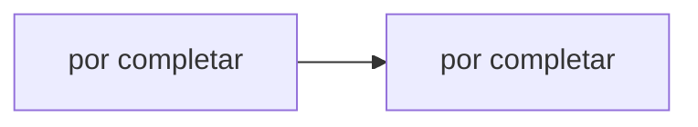

# Hit #7 — Sistema de inscripciones por ventanas

> **Autor:** por asignar · **Estado:** pendiente

## Qué resuelve

D coordina ventanas fijas de 60 segundos con un registro presente y uno futuro, y persiste cada ventana en JSON.

## Cómo ejecutarlo

```bash
# Desde la raíz del repositorio
python -m hit7.<archivo>
```

## Arquitectura



## Decisiones de diseño

- _Por completar por el autor del Hit._

## Cómo se probó

- _Por completar._

## Limitaciones conocidas

- _Por completar._
