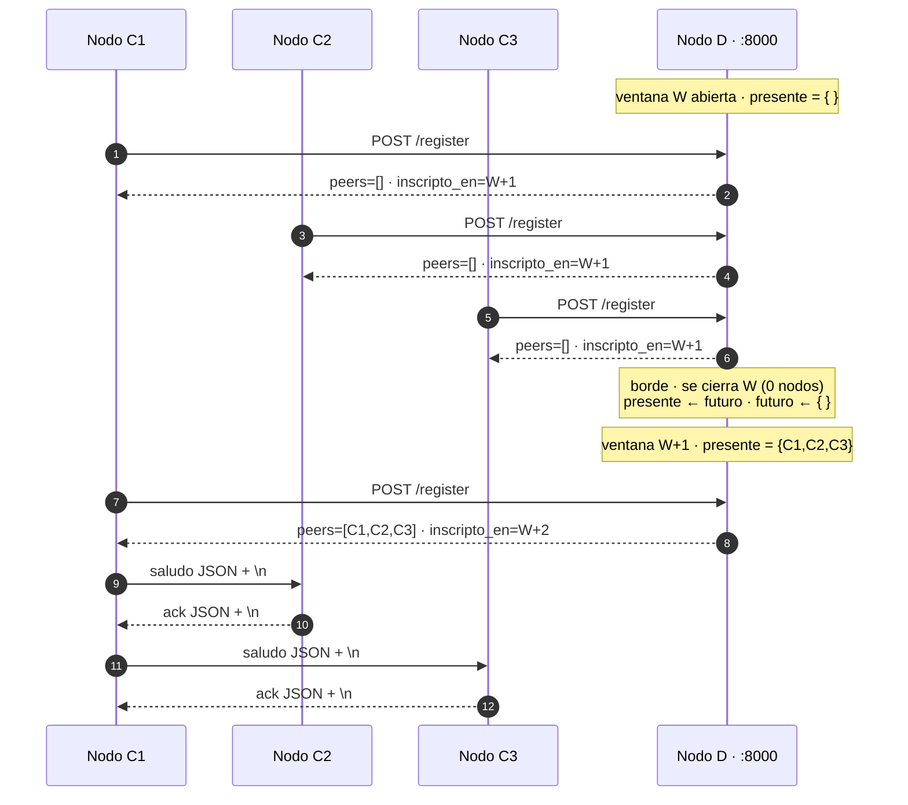

# Hit #7 — Sistema de inscripciones por ventanas

> **Autor:** Federico Kasparian · **Estado:** terminado

## Qué resuelve

El Hit 6 responde *¿quién está vivo?* con un TTL, y esa respuesta puede cambiar
**en cualquier instante**: dos nodos C que preguntan con medio segundo de
diferencia pueden recibir listas distintas.

El Hit 7 cambia el modelo. El tiempo se corta en **ventanas fijas de 60 segundos
alineadas al reloj de pared**, y durante toda una ventana la membresía es
inmutable: todos los C ven exactamente lo mismo. Cada ventana cerrada se
persiste en `data/inscripciones.json`.

## El modelo, en tres reglas

**1. Alineación por truncamiento.** La ventana que contiene el instante `t`
empieza en `(t // duracion) * duracion`. Con ventanas de 60 segundos, arranca en
el segundo 0 de cada minuto. **Nadie negocia nada**: cada nodo mira su propio
reloj, trunca, y coincide con los demás. Es todo el mecanismo de coordinación, y
es una sola línea de código.

**2. Dos registros: presente y futuro.** Quien se inscribe durante la ventana
`W` queda anotado en `W+1` y recibe como respuesta los pares de `W`. **No entra a
la ventana en curso.**

Suena contraintuitivo, y ese es exactamente el punto: garantiza que la membresía
de una ventana en curso no cambie a mitad de camino. Si el recién llegado entrara
al presente, un par que consultó al segundo 5 y otro que consultó al segundo 55
tendrían vistas distintas de la misma ventana, y estaríamos de vuelta en el
Hit 6.

**3. La rotación reemplaza al TTL.** En el borde: `presente ← futuro`,
`futuro ← {}`. Sobrevivir exige re-inscribirse en cada ventana. No hay TTL ni
purga: quien no renueva simplemente no está en el próximo presente. La liveness
pasa a ser un efecto del calendario.

## Contrato HTTP

**`POST /register`** — cuerpo `{"host": "10.0.0.5", "port": 54321}`

```json
{
  "ventana": "2026-09-05T01:29:00Z",
  "peers": [
    {"host": "127.0.0.1", "port": 22135},
    {"host": "127.0.0.1", "port": 22136}
  ],
  "inscripto_en": "2026-09-05T01:30:00Z",
  "proxima_ventana_en_s": 23.4
}
```

`ventana` y `peers` son el contrato del [README raíz](../README.md) sección 4:
`ventana` es la del **presente**, la que corresponde a esos pares.
`inscripto_en` y `proxima_ventana_en_s` son **campos agregados**; no rompen a
nadie que lea el contrato original y le permiten a C alinearse con el borde en
lugar de sondear a ciegas.

**`GET /peers`** — `{ventana, peers}` de la ventana presente.

**`GET /health`** — los cinco campos del contrato **sin renombrar ni quitar
ninguno**, más cuatro que hacen visible el mecanismo:

```json
{
  "servicio": "registro-d",
  "estado": "ok",
  "nodos_activos": 3,
  "uptime_s": 240,
  "ventana_actual": "2026-09-05T01:29:00Z",
  "ventana_futura": "2026-09-05T01:30:00Z",
  "inscriptos_futuros": 2,
  "ventanas_cerradas": 3,
  "duracion_ventana_s": 60
}
```

**`GET /ventanas`** — el historial de ventanas cerradas. Permite sacar la
evidencia con un `curl`, sin entrar al contenedor a buscar el archivo.

## Cómo ejecutarlo

Terminal 1 — el registro:

```bash
python -m hit7.nodo_d --host 127.0.0.1 --port 8000 --ventana 60
```

Terminales 2, 3 y 4 — un nodo C en cada una:

```bash
python -m hit7.nodo_c --d-host 127.0.0.1 --d-port 8000 --intervalo 5
```

Terminal 5:

```bash
curl http://127.0.0.1:8000/health
curl http://127.0.0.1:8000/ventanas

curl -X POST -H "Content-Type: application/json" \
  -d '{"host":"10.0.0.5","port":9001}' \
  http://127.0.0.1:8000/register
```

> **En PowerShell**, `curl` es un alias de `Invoke-WebRequest` y manipula las
> comillas antes de pasárselas al ejecutable. Para el `POST`:
>
> ```powershell
> Invoke-RestMethod -Uri http://127.0.0.1:8000/register -Method Post `
>   -ContentType 'application/json' -Body '{"host":"10.0.0.5","port":9001}'
> ```

Opciones adicionales: `--ventana` fija la duración en segundos y `--archivo`
dónde se persisten las ventanas cerradas (por defecto `data/inscripciones.json`,
o lo que indique la variable de entorno `ARCHIVO_INSCRIPCIONES`).

**Al arrancar, `/peers` va a estar vacío durante hasta un minuto.** No es un
error: es la regla 2. Los nodos entran a la ventana siguiente.

### En Docker

El [`Dockerfile`](../Dockerfile) del repositorio despliega **este** nodo D. Es el
único servicio que se publica; los nodos C corren en las máquinas del grupo.

```bash
docker build -t tp1-nodo-d:local .
docker run --rm -p 8000:8000 tp1-nodo-d:local
docker run --rm -e PORT=8080 -p 8080:8080 tp1-nodo-d:local   # como en Cloud Run
```

Imagen resultante: **254 MB**.

## Arquitectura



Lo que muestra el diagrama y no muestra un grafo: **durante la ventana W nadie se
saluda**, porque el presente está vacío. Los saludos aparecen recién en `W+1`,
cuando la rotación promueve a los tres inscriptos.

Los mensajes entre nodos C siguen siendo NDJSON sobre TCP, igual que en los
Hits 5 y 6. Lo que cambia acá es **cuándo** un nodo entra al conjunto de pares.

## Decisiones de diseño

- **Alineación por truncamiento en lugar de negociar un inicio.** `(t // V) * V`
  hace que todos los nodos coincidan en cuál es la ventana actual sin
  intercambiar un solo mensaje. La alternativa —que D anuncie el inicio de cada
  ventana— agregaría un protocolo entero para resolver algo que el reloj ya
  resuelve.

- **La inscripción va a la ventana futura.** Es la decisión central del Hit.
  Cuesta una latencia de incorporación de hasta una ventana y compra que la
  membresía de una ventana en curso sea inmutable para todos los observadores.

- **La rotación reemplaza al TTL del Hit 6.** No hay timestamps por nodo ni
  purga: los registros son `set` de `(host, port)` y la pertenencia la decide el
  calendario. El `set` además hace la inscripción idempotente por construcción.

- **`rotar_si_corresponde()` es idempotente y se llama desde dos lugares.**
  Compara el identificador de ventana calculado contra el que está abierto y, si
  coinciden, no hace nada. Eso permite invocarla sin coordinar a los dos
  llamadores: el **hilo del borde** garantiza que las ventanas se cierren aunque
  no llegue ningún request, y la llamada **al principio de cada operación**
  garantiza que un pedido que entra tres milisegundos después del borde se
  atienda con la ventana correcta.

- **El hilo del borde recalcula cuánto falta en cada vuelta.** Un
  `sleep(duracion)` fijo acumularía deriva y terminaría desalineado del reloj de
  pared, que es justamente la propiedad que sostiene la regla 1. Usa
  `Event.wait()` en lugar de `time.sleep()` para que el apagado sea inmediato.

- **Escritura atómica con `os.replace()`.** Se escribe a `<archivo>.tmp` y recién
  después se reemplaza. `os.replace` es atómico tanto en POSIX como en Windows.
  Escribir directamente sobre el archivo final dejaría un JSON truncado si el
  proceso muriera a mitad de la escritura, y ese archivo ya no se podría releer
  al arrancar.

- **Se persiste fuera del lock.** La rotación copia el historial dentro del lock
  y escribe a disco afuera, para no bloquear a los demás hilos durante el I/O.

- **El historial se recupera al arrancar.** Un reinicio de D no borra la
  evidencia. Si el archivo está corrupto se registra `historial_ilegible` y el
  nodo arranca vacío en lugar de morir.

- **Los cinco campos originales de `/health` no se tocan.** Son los que mira el
  evaluador y el health check del despliegue. Se agregan campos, nunca se
  renombran.

- **El reloj se inyecta por parámetro.** Sin eso, probar una rotación exigiría
  dormir 60 segundos y `pytest.ini` corta cualquier prueba a los 30. Las 16
  pruebas de este Hit rotan ventanas sin dormir ni un milisegundo.

- **`Ventanas` no sabe nada de HTTP.** La lógica vive en una clase pura que
  recibe un reloj y un archivo. Eso permite probarla sin sockets y, si el grupo
  necesita un `hit8/nodo_d.py` que hable gRPC, ese archivo es un envoltorio de
  unas cuarenta líneas sobre la misma clase.

- **Este módulo no importa nada de `hit6/`.** El `Dockerfile` copia solo
  `common/` y `hit7/`, y el `.dockerignore` excluye `hit6/`. Un import cruzado
  construiría una imagen que pasa el CI en verde y explota al arrancar, porque
  el job `imagen` construye pero nunca corre el contenedor. Se verificó a mano
  con `docker run --rm tp1-nodo-d:local ls /app`.

- **`--archivo` se agrega sobre el parser común en lugar de modificarlo.**
  `parser_nodo_d()` devuelve un `ArgumentParser`, así que la bandera se suma en
  el `main()` de este Hit. `common/cli.py` es de todo el grupo y esta opción es
  solo de acá.

## Cómo se probó

### Pruebas automatizadas

```bash
python -m pytest tests/test_hit7.py -v
```

Resultado: **16 passed**, en menos de un segundo y sin dormir. Cubren:

- La aritmética de ventanas: que el truncamiento alinee al minuto y que todo el
  minuto —incluidos los bordes— pertenezca a la misma ventana.
- **Que el que se inscribe no entre a la ventana en curso.** Es la regla central.
- Que la rotación promueva el futuro a presente y deje el futuro vacío.
- Que el que no renueva desaparezca en la ventana siguiente.
- Que inscribirse dos veces no duplique.
- Que rotar dos veces dentro de la misma ventana no cierre dos.
- Que `proxima_ventana_en_s` cuente correctamente lo que falta.
- **Que se persistan tres ventanas consecutivas** con sus nodos y que el `fin` de
  cada una sea el nombre de la siguiente.
- Que el historial se recupere al reiniciar y que un archivo corrupto no tumbe
  el arranque.
- Que la escritura atómica no deje archivos `.tmp` colgados.
- Que `/health` conserve los cinco campos del contrato.
- Que `/register` inscriba en la ventana siguiente.

Suite completa del repositorio:

```bash
python -m pytest -v
```

Resultado: **42 passed**.

### Prueba manual

Cuatro procesos en una máquina Windows: un nodo D con `--ventana 60` y tres
nodos C con `--intervalo 5`. Se mató el tercer C a los dos minutos.

**Las ventanas se cierran solas, aunque no llegue ningún request.** Los bordes
caen exactamente en el segundo 0 de cada minuto:

```json
{"ts": "2026-09-05T01:27:00Z", "evento": "ventana_cerrada", "ventana": "2026-09-05T01:26:00Z", "nodos": 0}
{"ts": "2026-09-05T01:27:00Z", "evento": "ventana_abierta", "ventana": "2026-09-05T01:27:00Z", "nodos": 3}
{"ts": "2026-09-05T01:28:00Z", "evento": "ventana_cerrada", "ventana": "2026-09-05T01:27:00Z", "nodos": 3}
{"ts": "2026-09-05T01:28:00Z", "evento": "ventana_abierta", "ventana": "2026-09-05T01:28:00Z", "nodos": 3}
```

**Los nodos C detectan el cambio de ventana**, y la primera vuelta confirma la
regla 2: se inscribieron, y aun así recibieron cero pares.

```json
{"nodo": "nodo-c-hit7-22135", "evento": "ventana_cambio", "anterior": null, "nueva": "2026-09-05T01:26:00Z", "pares": 0}
{"nodo": "nodo-c-hit7-22135", "evento": "ventana_cambio", "anterior": "2026-09-05T01:26:00Z", "nueva": "2026-09-05T01:27:00Z", "pares": 3}
{"nodo": "nodo-c-hit7-22135", "evento": "ventana_cambio", "anterior": "2026-09-05T01:29:00Z", "nueva": "2026-09-05T01:30:00Z", "pares": 2}
```

**El nodo muerto se sigue saludando mientras es miembro de la ventana.** Después
de matar al C del puerto `22137`, los otros dos siguieron intentando saludarlo
hasta que dejó de ser miembro:

```json
{"nivel": "WARN", "nodo": "nodo-c-hit7-22135", "evento": "fallo_saludo", "destino": "127.0.0.1:22137", "error": "[WinError 10061] ... el equipo de destino denegó expresamente dicha conexión"}
```

**El desfasaje entre los dos contadores de `/health` es la foto del mecanismo.**
Muestreando cada cinco segundos durante la corrida:

| Ventanas cerradas | `nodos_activos` | `inscriptos_futuros` | Qué está pasando |
|---:|---:|---:|---|
| 0 | 0 | 3 | Los tres se inscribieron; el presente sigue vacío |
| 1 | 3 | 3 | La rotación los promovió |
| 2 | 3 | 3 | **Se mata C3 acá** |
| 3 | 3 | **2** | Sigue siendo miembro, pero ya nadie lo inscribe |
| 4 | **2** | 2 | Recién ahora desaparece del presente |

La fila con `nodos_activos: 3` e `inscriptos_futuros: 2` es el punto: D ya sabe
que el nodo murió —nadie lo inscribió para la próxima— y sin embargo lo sigue
devolviendo en `/peers`, **porque la membresía de una ventana en curso no se
toca**. Eso es la consistencia comprada con latencia de detección, medida en vez
de argumentada.

### Evidencia persistida

El archivo completo está en [`docs/evidencia-hit7.json`](../docs/evidencia-hit7.json),
obtenido con `curl -o docs/evidencia-hit7.json http://127.0.0.1:8000/ventanas`.
Cinco ventanas consecutivas:

| Ventana | Nodos |
|---|---:|
| `2026-09-05T01:26:00Z` | 0 |
| `2026-09-05T01:27:00Z` | 3 |
| `2026-09-05T01:28:00Z` | 3 |
| `2026-09-05T01:29:00Z` | 3 |
| `2026-09-05T01:30:00Z` | 2 |

El `fin` de cada registro coincide con el `ventana` del siguiente: las ventanas
son contiguas y no hay huecos.

### Docker

Verificado a mano, porque el CI construye la imagen pero nunca la corre:

- `docker run --rm tp1-nodo-d:local ls /app` lista `common`, `hit7` y
  `requirements.txt`. No hay rastro de `hit6/`.
- El contenedor cierra ventanas cada 60 segundos sin recibir un solo request.
- Con `-e PORT=8080` el servidor levanta en 8080, como haría Cloud Run o Render.

## Limitaciones conocidas

- **Los relojes de los nodos no están sincronizados.** La regla 1 asume que todos
  ven la misma hora. En la práctica hay deriva, y un nodo C con el reloj dos
  segundos adelantado calcula mal cuándo re-inscribirse. En esta corrida no se
  notó porque los cuatro procesos comparten el reloj de la misma máquina. La
  solución real es NTP o relojes lógicos; queda fuera del alcance del trabajo.

- **La latencia de detección de una caída está entre una y dos ventanas**, según
  en qué momento del minuto muera el nodo: si alcanzó a inscribirse antes de
  morir, sigue siendo miembro una ventana más. Es el precio del modelo, no un
  defecto de la implementación.

- **Un nodo recién llegado espera hasta una ventana entera antes de ver a
  alguien.** Predictibilidad comprada con latencia de incorporación.

- **El filesystem del contenedor es efímero.** En Cloud Run o Render,
  `data/inscripciones.json` se pierde en cada redespliegue y no se comparte
  entre instancias. Sirve como evidencia de una corrida, no como almacenamiento
  durable. Con más de una instancia, además, cada una tendría su propio conjunto
  de ventanas.

- **El contenedor necesita varios `Ctrl+C` para frenar.** El `CMD` del
  `Dockerfile` es `sh -c "python ..."`, así que PID 1 es `sh` y no reenvía
  `SIGTERM` al proceso Python: nunca se ejecuta el cierre ordenado. **No hay
  pérdida de datos** —una ventana se persiste en su borde, no al apagar—, pero
  la línea `servidor_detenido` no llega a registrarse. Se arregla con `exec` en
  el `CMD` más un manejador de `SIGTERM` en `main()`; el `Dockerfile` es de otro
  integrante y el cambio quedó propuesto en el Pull Request.

- **D es un punto único de falla y no está replicado.** Si cae, los nodos C
  sobreviven con la última lista que recibieron, pero el sistema deja de
  incorporar y de dar de baja.

- **El historial crece sin límite** en RAM y en disco: una ventana por minuto son
  unas 1.440 por día. Falta una política de retención.

- **Sin autenticación ni TLS.** Cualquiera que alcance el puerto puede inscribir
  nodos falsos o leer la topología.

- **Los nodos D del Hit 6 y del Hit 7 escriben en `logs/nodo-d.log`.** Son el
  mismo rol de nodo, así que comparten el nombre de archivo; correr los dos a la
  vez entrelaza los eventos. En el uso documentado solo corre uno.
