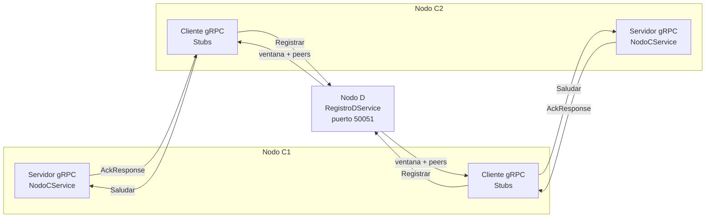

# Hit #8 — gRPC / Protocol Buffers

> **Autor:** Justino Bernal · **Estado:** terminado

## Qué resuelve

La comunicación de los nodos C deja de utilizar JSON/NDJSON sobre sockets TCP
directos y pasa a utilizar llamadas RPC mediante gRPC.

Los mensajes se definen formalmente en `hit8/nodos.proto` y se serializan con
Protocol Buffers. Cada nodo C:

1. Levanta un servidor gRPC en un puerto aleatorio.
2. Se registra en el nodo D.
3. Recibe la lista de pares disponibles.
4. Invoca el RPC `Saludar` de cada par.
5. Recibe un `AckResponse` relacionado con el saludo mediante `ref`.

También se compara JSON/TCP contra Protobuf/gRPC en tamaño y latencia.

## Generación del código Protobuf

Los archivos Python generados no se guardan en Git. Deben regenerarse desde la
raíz del repositorio:

```bash
python -m grpc_tools.protoc \
  -I. \
  --python_out=. \
  --grpc_python_out=. \
  hit8/nodos.proto
```

Este comando genera:

- `hit8/nodos_pb2.py`: clases de los mensajes Protobuf.
- `hit8/nodos_pb2_grpc.py`: clientes, servidores y registro de servicios gRPC.

No deben modificarse manualmente porque se generan desde `nodos.proto`.

## Cómo ejecutarlo

Primero debe encontrarse activo un nodo D que implemente
`RegistroDService` en el puerto gRPC `50051`.

Después se inicia cada nodo C desde una terminal diferente:

```bash
python -m hit8.nodo_c \
  --d-host 127.0.0.1 \
  --d-port 50051 \
  --intervalo 2
```

No se indica puerto para C. El sistema operativo asigna automáticamente uno
libre mediante `add_insecure_port("0.0.0.0:0")`.

Para detener el nodo se utiliza `Ctrl+C`.

## Contrato RPC

```protobuf
service NodoCService {
  rpc Saludar(SaludoRequest) returns (AckResponse);
}

service RegistroDService {
  rpc Registrar(RegistroRequest) returns (RegistroResponse);
  rpc ObtenerPares(PeersRequest) returns (PeersResponse);
}
```

`Saludar`, `Registrar` y `ObtenerPares` son RPC unarios: reciben una solicitud
y devuelven una respuesta.

## Arquitectura



## Decisiones de diseño

- **Protocol Buffers como contrato formal.** `nodos.proto` define nombres,
  tipos y números de cada campo. Evita validación manual propia de JSON.

- **RPC unario.** Cada saludo produce exactamente un ACK. No se necesita
  streaming porque solo existe una solicitud pendiente por par.

- **Puerto aleatorio.** `add_insecure_port("0.0.0.0:0")` pide al sistema
  operativo un puerto libre y devuelve el número seleccionado.

- **Descubrimiento de IP local.** Un socket UDP permite conocer qué interfaz
  utilizaría C para llegar a D. No envía información de aplicación.

- **Pool de hilos.** gRPC utiliza `ThreadPoolExecutor` para atender varios
  saludos simultáneamente.

- **Servidor y cliente simultáneos.** El servidor gRPC mantiene sus propios
  hilos mientras el hilo principal registra C y saluda a sus pares.

- **Stubs generados.** `NodoCServiceStub` y `RegistroDServiceStub` representan
  servicios remotos y ocultan sockets, framing y serialización.

- **Deadlines.** Cada RPC tiene timeout de cinco segundos para evitar bloqueos
  indefinidos cuando D o un par no responden.

- **Backoff exponencial.** Si falla el registro, C espera 1, 2, 4, 8 y hasta
  16 segundos antes de reintentar.

- **Correlación mediante `ref`.** El ACK copia el timestamp del saludo. El
  cliente comprueba la coincidencia antes de aceptarlo.

- **Medición de tamaño.** `ByteSize()` devuelve el tamaño serializado del
  mensaje Protobuf.

- **Medición de latencia.** `perf_counter_ns()` mide el tiempo de ida y vuelta
  con un reloj monotónico de alta precisión.

## Cómo se probó

### Pruebas automatizadas

```bash
python -m pytest tests/test_hit8.py -v
```

Las pruebas levantan servidores gRPC reales en puertos aleatorios y verifican:

- Recepción de `SaludoRequest`.
- Respuesta mediante `AckResponse`.
- Coincidencia entre `ref` y timestamp.
- Registro de eventos.
- Registro de C frente a un D simulado.
- Recepción de ventana y lista de pares.

Resultado: `2 passed`.

Suite completa:

```bash
python -m pytest -v
```

Resultado: `12 passed`.

### Benchmark

Ejecutado en una Mac local:

```bash
python -m hit8.benchmark --iteraciones 500
```

Se realizaron 20 intercambios de calentamiento y 500 iteraciones medidas.
Ambos protocolos utilizaron conexiones persistentes sobre loopback.

| Métrica | JSON/NDJSON sobre TCP | Protobuf/gRPC |
|---|---:|---:|
| Saludo | 117 bytes | 52 bytes |
| ACK | 122 bytes | 60 bytes |
| Total ida y vuelta | 239 bytes | 112 bytes |
| Latencia promedio | 0,035 ms | 0,097 ms |
| Latencia mediana | 0,035 ms | 0,097 ms |
| Latencia p95 | 0,040 ms | 0,110 ms |

Protocol Buffers redujo el payload total un **53,1 %**.

gRPC presentó mayor latencia local. Esto se debe al procesamiento adicional de
HTTP/2, despacho RPC y capas internas del framework. Por lo tanto, menor tamaño
serializado no implica automáticamente menor latencia.

Los tamaños no incluyen cabeceras TCP, HTTP/2 ni el framing interno de gRPC.

## Limitaciones conocidas

- Se utiliza `insecure_channel`, sin TLS ni autenticación, porque el ejercicio
  se concentra en transporte y RPC.

- La implementación completa depende de que D implemente `RegistroDService`
  siguiendo `nodos.proto`.

- Los archivos `nodos_pb2.py` y `nodos_pb2_grpc.py` deben regenerarse después
  de clonar el repositorio.

- El benchmark fue local. Una red real puede producir resultados diferentes
  por latencia, pérdida de paquetes y variabilidad.

- `ByteSize()` mide payload Protobuf, no cabeceras HTTP/2 ni gRPC.

- Los timestamps tienen precisión de segundos. Esto funciona porque cada
  cliente mantiene un solo saludo pendiente por par.

- Cada ciclo saluda los pares secuencialmente. Una cantidad grande de nodos
  podría beneficiarse de llamadas concurrentes.